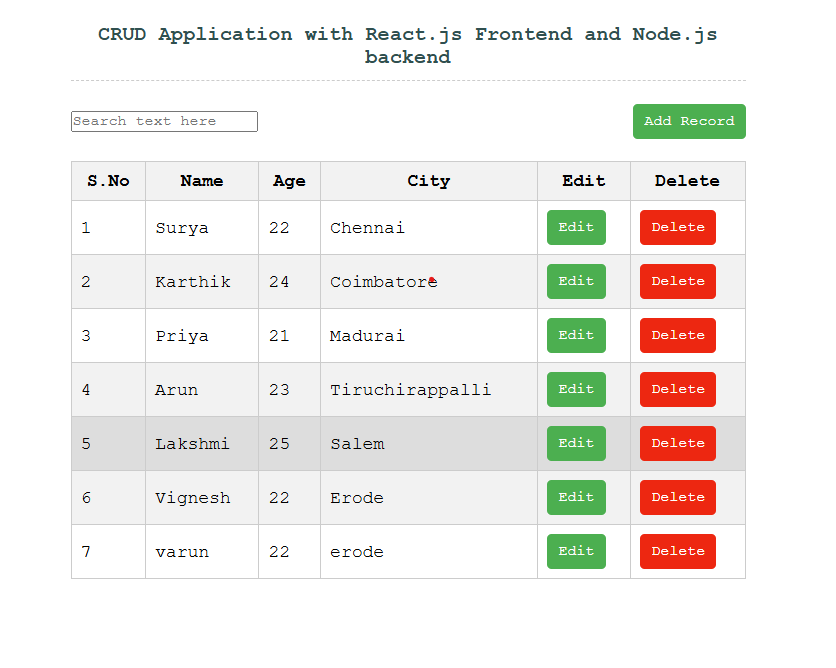
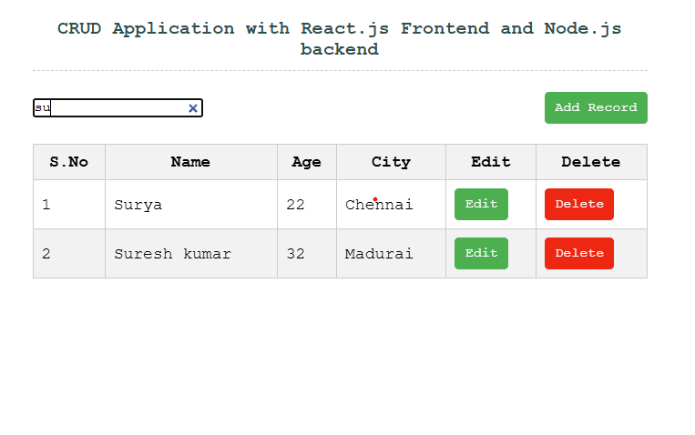
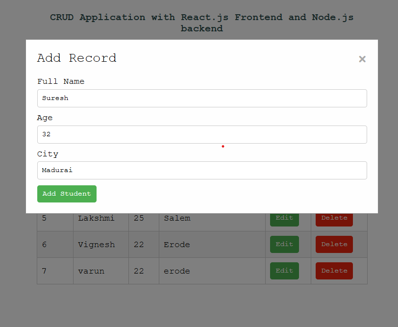
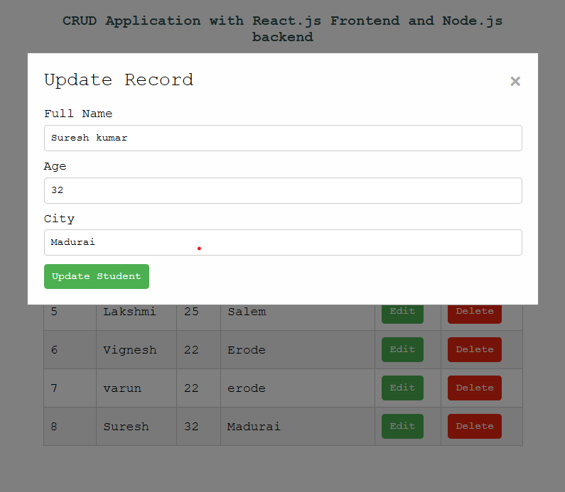
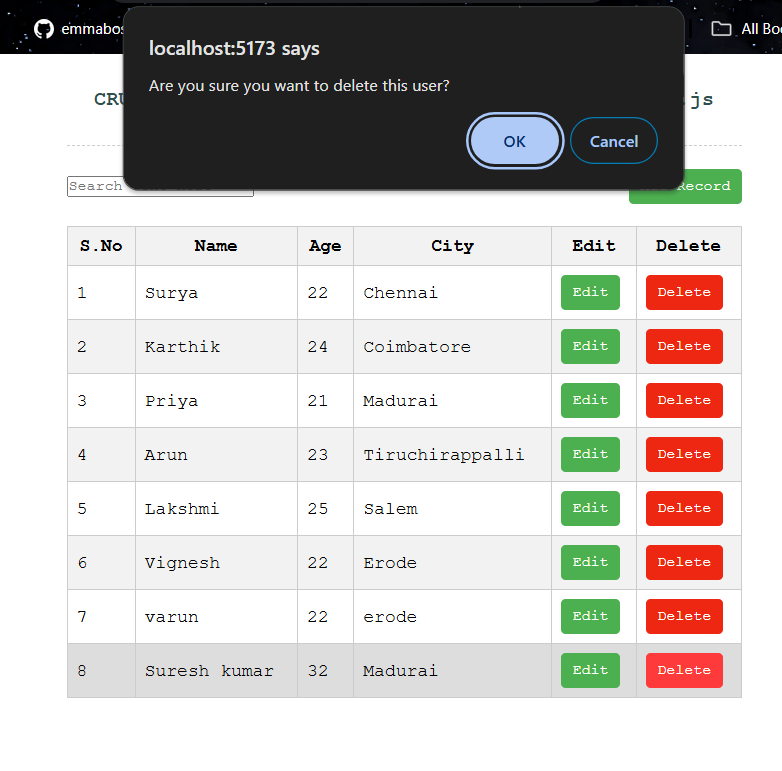

# React CRUD Application 🎉

This project is a fully functional **CRUD (Create, Read, Update, Delete)** application built using **React.js** for the frontend and **Node.js (Express)** for the backend. The application manages a list of students, allowing you to add, edit, delete, and search through student records.

---

## Features 🚀

- **View All Records**: Displays a list of students with their details.
- **Add New Record**: Easily add a new student's information.
- **Edit Existing Record**: Update any student's details.
- **Delete Record**: Remove a student from the list.
- **Search**: Filter records by name or city in real time.
- **Responsive Design**: Works seamlessly on all devices.

---

## Tech Stack 🛠️

### **Frontend**

- **React.js**: UI development.
- **Axios**: For making HTTP requests.
- **Vite**: Fast development and build tool.

### **Backend**

- **Node.js**: JavaScript runtime.
- **Express.js**: Backend framework for building RESTful APIs.
- **File System Module (fs)**: For managing local JSON files.

---

## Installation and Setup 🚧

### **Prerequisites**

- Node.js and npm installed
- Git installed

### **Steps to Run Locally**

1. **Clone the Repository**:

   ```bash
   git clone https://github.com/Surya-2k4/React-CRUD.git
   cd React-CRUD
   ```

2. **Set Up the Backend**:

   ```bash
   cd server
   npm install
   node index.js
   ```

   The server will run at `http://localhost:8000`.

3. **Set Up the Frontend**:

   ```bash
   cd ../client
   npm install
   npm run dev
   ```

   The frontend will run at `http://localhost:5173`.

---

## Deployment 🌐

The project is deployed on GitHub Pages for the frontend.

### **Deploy Frontend to GitHub Pages**

1. Add the following script to your `package.json` (already included):

   ```json
   "homepage": "https://<your-github-username>.github.io/React-CRUD",
   "scripts": {
       "deploy": "vite build && gh-pages -d dist"
   }
   ```

2. Run the following command to deploy:

   ```bash
   npm run deploy
   ```

### **Access the Live App**

Visit: `https://<your-github-username>.github.io/React-CRUD`

---

## API Endpoints 📊

### **Base URL**: `http://localhost:8000`

| Method   | Endpoint        | Description                      |
| -------- | --------------- | -------------------------------- |
| `GET`    | `/students`     | Fetch all student records        |
| `POST`   | `/students`     | Add a new student record         |
| `PATCH`  | `/students/:id` | Update a specific student record |
| `DELETE` | `/students/:id` | Delete a specific student record |

---

## Folder Structure 🌐

```plaintext
React-CRUD/
├── client/          # Frontend code
│   └── src/
│        ├── App.js     # Main React component
│        ├── index.css # Global CSS styles
│        └── main.jsx  # Entry point
├── server/          # Backend code
│   ├── index.js   # Express server
│   └── sample.json # Local JSON database
└── README.md       # Documentation
```

---

## Screenshots 🎨

### **Home Page**



### **Record Searching Page**



### **Record Inserting Page**



### **Record Updating Page**



### **Record Deleting Page**




---

## Contributing 📚

Contributions are welcome! Feel free to fork this repository, create a new branch, and submit a pull request.

### **Steps**

1. Fork the repository.
2. Create a new branch:
   ```bash
   git checkout -b feature-name
   ```
3. Commit your changes:
   ```bash
   git commit -m "Add a meaningful message"
   ```
4. Push to the branch:
   ```bash
   git push origin feature-name
   ```
5. Open a pull request.

---


## Acknowledgments 🌈

- Special thanks to all contributors and users who supported this project.
- Built with ❤️ and a passion for coding!

---

## Contact 📢

For any queries or suggestions, please contact:

- **GitHub**: [Surya-2k4](https://github.com/Surya-2k4)
- **Email**: [suryanatarajan04@gmail.com](mailto:suryanatarajan04@gmail.com)
